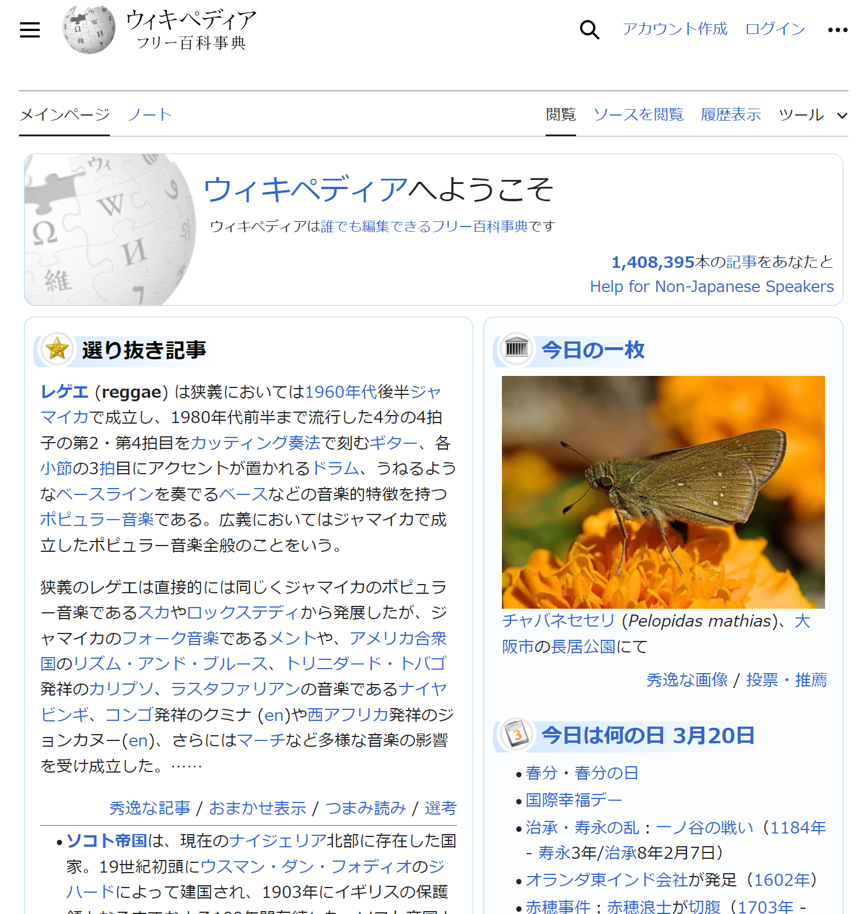
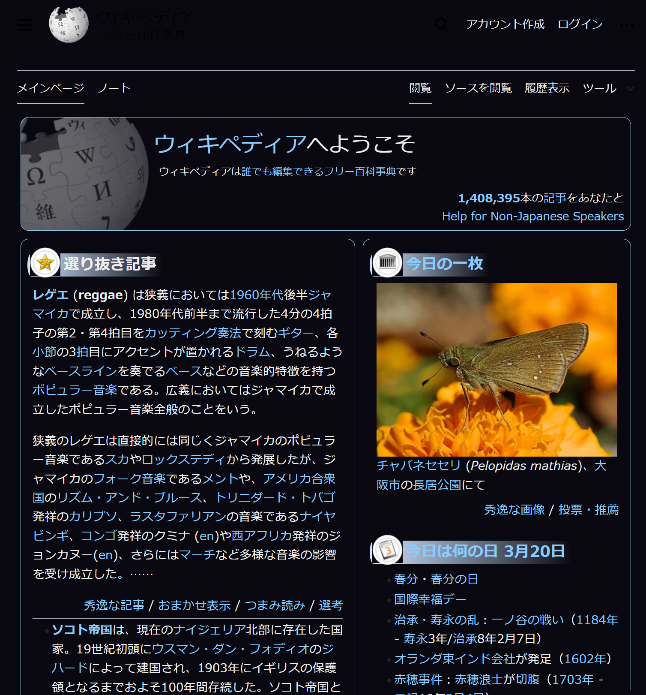

# Chrome Dark Mode Extension

This Chrome extension allows users to apply a dark mode to any website they visit. The extension provides a seamless and customizable dark mode experience, making it easier on the eyes and reducing eye strain, especially in low-light environments.  

## Features

- Toggle dark mode on and off with a single click on the extension icon
- Customize the dark mode colors (background, text, and links) through the options page
- Automatically apply dark mode to new tabs and websites
- Persist user preferences across browser sessions
- Exclude specific elements (e.g., images, videos) from being affected by dark mode

## Installation

1. Download or clone the extension files from the repository.
2. Open Google Chrome and navigate to `chrome://extensions`.
3. Enable "Developer mode" using the toggle switch in the top right corner.
4. Click on "Load unpacked" and select the directory containing the extension files.
5. The Chrome Dark Mode Extension should now be installed and visible in your browser toolbar.

## Usage

- Click on the extension icon in the browser toolbar to toggle dark mode on or off for the current website.
- To customize the dark mode colors, right-click on the extension icon and select "Options".
- In the options page, you can enable or disable dark mode, and choose custom colors for the background, text, and links.
- The extension will automatically apply your preferences to all websites you visit.

## File Structure

- `manifest.json`: The extension manifest file containing metadata and configuration.
- `background.js`: The background script responsible for managing the extension's state and applying dark mode to tabs.
- `content.js`: The content script injected into web pages to apply dark mode styles.
- `dark_mode.css`: The stylesheet containing the dark mode styles.
- `options.html`: The options page HTML template.
- `options.js`: The options page script for handling user preferences.

## Code Overview

### `manifest.json`

The manifest file defines the extension's metadata, permissions, and components. Key components include:

- `permissions`: Specifies the required permissions for the extension to function, such as `storage` and `activeTab`.
- `background`: Defines the background script (`background.js`) responsible for managing the extension's state.
- `content_scripts`: Specifies the content script (`content.js`) to be injected into web pages.
- `options_page`: Defines the options page (`options.html`) for user customization.

### `background.js`

The background script is responsible for managing the extension's state and applying dark mode to tabs. Key functionalities include:

- Storing and retrieving the extension's state (dark mode enabled and custom colors) using `chrome.storage.sync`.
- Listening for extension icon clicks and toggling dark mode on or off.
- Updating the extension icon's title based on the current state.
- Applying dark mode to new tabs and updating tabs when the extension's state changes.

### `content.js`

The content script is injected into web pages and applies the dark mode styles. It communicates with the background script to receive the current extension state and custom colors. Key functionalities include:

- Toggling the `dark-mode` class on the `body` element based on the extension state.
- Applying custom colors to the web page using CSS variables.

### `dark_mode.css`

The stylesheet contains the dark mode styles applied to web pages. It uses CSS variables to allow for custom color theming. The styles are applied to various elements such as the body, headers, paragraphs, links, and more. Images and media elements are excluded from the dark mode styles.

### `options.html` and `options.js`

The options page allows users to customize the dark mode colors and enable/disable the extension. The `options.html` file defines the UI elements, while the `options.js` script handles saving and loading user preferences using `chrome.storage.sync`.

## Limitations and Future Improvements

- The extension may not work perfectly on all websites due to the wide variety of web page structures and styles. In some cases, manual adjustments to the CSS styles might be necessary.
- Future improvements could include more granular control over the elements affected by dark mode, the ability to exclude specific websites, and support for additional customization options.

## Conclusion

The Chrome Dark Mode Extension provides an easy and customizable way to apply a dark theme to websites. By leveraging Chrome's extension APIs and injecting custom styles, the extension offers a seamless dark mode experience across the web. The modular architecture and use of Chrome's storage API allow for easy customization and persistence of user preferences.

Feel free to contribute to the project by submitting pull requests or reporting issues on the GitHub repository. Happy dark mode browsing!

# Chrome ダークモード拡張機能

このChrome拡張機能は、ユーザーが訪問するすべてのウェブサイトにダークモードを適用することができます。シームレスでカスタマイズ可能なダークモード体験を提供し、目の負担を軽減し、特に低照度環境での目の疲れを軽減します。

## 機能

- 拡張機能のアイコンをクリックするだけでダークモードのオン/オフを切り替えられます
- オプションページでダークモードの色（背景、テキスト、リンク）をカスタマイズできます
- 新しいタブやウェブサイトに自動的にダークモードを適用します
- ユーザーの設定をブラウザのセッション間で保持します
- 特定の要素（画像、動画など）がダークモードの影響を受けないようにすることができます

## インストール

1. リポジトリから拡張機能のファイルをダウンロードまたはクローンします。
2. Google Chromeを開き、`chrome://extensions`に移動します。
3. 右上の切り替えスイッチを使用して「デベロッパーモード」を有効にします。
4. 「パッケージ化されていない拡張機能を読み込む」をクリックし、拡張機能のファイルが含まれるディレクトリを選択します。
5. Chrome ダークモード拡張機能がインストールされ、ブラウザのツールバーに表示されます。

## 使用方法

- ブラウザのツールバーにある拡張機能のアイコンをクリックすると、現在のウェブサイトのダークモードのオン/オフが切り替わります。
- ダークモードの色をカスタマイズするには、拡張機能のアイコンを右クリックして「オプション」を選択します。
- オプションページでは、ダークモードの有効/無効を切り替えたり、背景、テキスト、リンクのカスタムカラーを選択したりできます。
- 拡張機能は自動的にユーザーの設定をすべての訪問したウェブサイトに適用します。

## ファイル構成

- `manifest.json`: メタデータと設定を含む拡張機能のマニフェストファイルです。
- `background.js`: 拡張機能の状態を管理し、タブにダークモードを適用するバックグラウンドスクリプトです。
- `content.js`: ダークモードのスタイルを適用するためにウェブページに挿入されるコンテンツスクリプトです。
- `dark_mode.css`: ダークモードのスタイルを含むスタイルシートです。
- `options.html`: オプションページのHTMLテンプレートです。
- `options.js`: ユーザーの設定を処理するオプションページのスクリプトです。

## コードの概要

### `manifest.json`

マニフェストファイルは、拡張機能のメタデータ、権限、コンポーネントを定義します。主要なコンポーネントは次のとおりです。

- `permissions`: 拡張機能が機能するために必要な権限（`storage`や`activeTab`など）を指定します。
- `background`: 拡張機能の状態を管理するバックグラウンドスクリプト（`background.js`）を定義します。
- `content_scripts`: ウェブページに挿入されるコンテンツスクリプト（`content.js`）を指定します。
- `options_page`: ユーザーのカスタマイズ用のオプションページ（`options.html`）を定義します。

### `background.js`

バックグラウンドスクリプトは、拡張機能の状態を管理し、タブにダークモードを適用する役割を担います。主な機能は次のとおりです。

- `chrome.storage.sync`を使用して、拡張機能の状態（ダークモードの有効/無効とカスタムカラー）を保存および取得します。
- 拡張機能のアイコンのクリックをリッスンし、ダークモードのオン/オフを切り替えます。
- 現在の状態に基づいて拡張機能のアイコンのタイトルを更新します。
- 新しいタブにダークモードを適用し、拡張機能の状態が変更されたときにタブを更新します。

### `content.js`

コンテンツスクリプトはウェブページに挿入され、ダークモードのスタイルを適用します。バックグラウンドスクリプトと通信して、現在の拡張機能の状態とカスタムカラーを受け取ります。主な機能は次のとおりです。

- 拡張機能の状態に基づいて、`body`要素に`dark-mode`クラスを切り替えます。
- CSSの変数を使用して、ウェブページにカスタムカラーを適用します。

### `dark_mode.css`

スタイルシートには、ウェブページに適用されるダークモードのスタイルが含まれています。カスタムカラーのテーマ設定を可能にするために、CSS変数を使用しています。スタイルは、body、ヘッダー、段落、リンクなど、さまざまな要素に適用されます。画像やメディア要素は、ダークモードのスタイルから除外されます。

### `options.html`と`options.js`

オプションページでは、ユーザーがダークモードの色をカスタマイズしたり、拡張機能を有効/無効にしたりできます。`options.html`ファイルはUIの要素を定義し、`options.js`スクリプトは`chrome.storage.sync`を使用してユーザーの設定の保存と読み込みを処理します。

## 制限事項と今後の改善点

- ウェブページの構造やスタイルは多種多様であるため、すべてのウェブサイトで完璧に機能するとは限りません。場合によっては、CSSスタイルを手動で調整する必要があるかもしれません。
- 今後の改善点としては、ダークモードの影響を受ける要素をより細かく制御できるようにすること、特定のウェブサイトを除外する機能、追加のカスタマイズオプションのサポートなどが考えられます。

## 結論

Chrome ダークモード拡張機能は、ウェブサイトにダークテーマを適用する簡単でカスタマイズ可能な方法を提供します。Chromeの拡張機能APIを活用し、カスタムスタイルを挿入することで、ウェブ全体でシームレスなダークモード体験を提供します。モジュール式のアーキテクチャとChromeのストレージAPIの使用により、ユーザーの設定を簡単にカスタマイズし、永続化することができます。

GitHubのリポジトリでプルリクエストを送信したり、問題を報告したりすることで、このプロジェクトに貢献してください。ダークモードでのブラウジングをお楽しみください！

